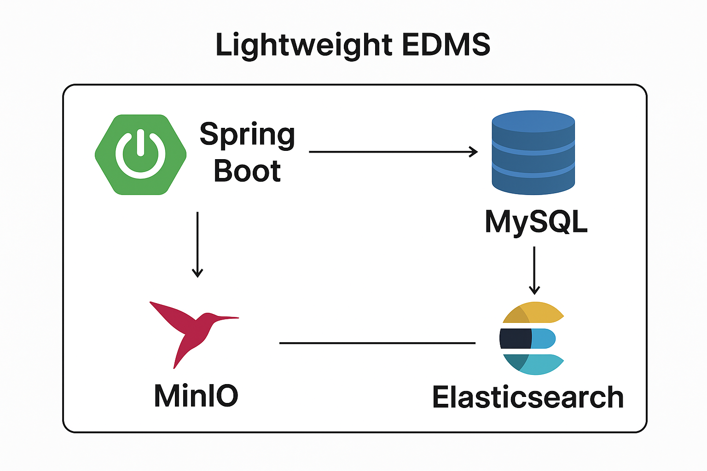

---

# Lightweight EDMS

A lightweight **Electronic Document Management System (EDMS)** built with **Spring Boot**, leveraging **MinIO** for file storage, **MySQL** for metadata, and **Elasticsearch** for full-text search capabilities. This system allows storing, managing, and searching documents efficiently.

---

## Features

* Upload, download, and delete documents.
* Store document metadata including title, description, and tags.
* Automatic extraction of text from PDFs, Word documents, Excel files, and plain text files.
* Full-text search in documents using Elasticsearch.
* Lightweight, easy-to-deploy Spring Boot application.
* RESTful APIs for programmatic access.

---

## Technology Stack



* **Backend**: Java Spring Boot
* **Database**: MySQL (for document metadata)
* **File Storage**: MinIO (S3-compatible object storage)
* **Search Engine**: Elasticsearch (for keyword search in documents)
* **API Documentation**: OpenAPI/Swagger

---

## Entities

### Document

```java
@Entity
@Data
public class Document {
    @Id
    private String id;
    private String filename;
    private String contentType;
    private long size;
}
```

### Metadata

```java
@Entity
@Data
public class Metadata {
    @Id
    private String docId;

    private String title;

    @Column(length = 1000)
    private String description;

    private String tags;

    public void setDescription(String description) {
        if (description != null && description.length() > 1000) {
            this.description = description.substring(0, 1000);
        } else {
            this.description = description;
        }
    }
}
```

> **Note:** The `description` field stores extracted document content (up to 1000 characters).

---

## API Endpoints

### Metadata Controller

* **Get Metadata by ID**

```http
GET /api/metadata/{docId}
```

* **Save Metadata**

```http
POST /api/metadata/{docId}
Content-Type: application/json
Body: Metadata JSON
```

* **Get All Metadata**

```http
GET /api/metadata
```

### Document Controller

* **Upload Document**

```http
POST /api/documents/upload
Content-Type: multipart/form-data
Body: file
```

* **Download Document**

```http
GET /api/documents/{id}
```

* **Delete Document**

```http
DELETE /api/documents/{id}
```

* **List All Documents**

```http
GET /api/documents
```

### Search Controller

* **Search Documents by Keyword**

```http
GET /api/search?q=keyword
```

---

## Text Extraction Logic

```java
public Metadata extractText(MultipartFile file, String docId) throws IOException {
    String sb = "Unable to extract";
    String fileName = file.getOriginalFilename();
    if (fileName == null) throw new IllegalArgumentException("Invalid file: no name provided.");
    String lowerName = fileName.toLowerCase();

    if (lowerName.endsWith(".pdf")) sb = extractFromPdf(file);
    else if (lowerName.endsWith(".docx") || lowerName.endsWith(".doc")) sb = extractFromWord(file);
    else if (lowerName.endsWith(".xls") || lowerName.endsWith(".xlsx")) sb = extractFromExcel(file);
    else if (lowerName.endsWith(".txt")) sb = extractFromTxt(file);
    else throw new IllegalArgumentException("Unsupported file type: " + fileName);

    Metadata metadata = new Metadata();
    metadata.setDocId(docId);
    metadata.setTitle(fileName);
    metadata.setDescription(sb);
    metadata.setTags(lowerName);

    return metadata;
}
```

---

## Getting Started

### Prerequisites

* Java 17+
* Maven or Gradle
* MySQL Database
* MinIO Server
* Elasticsearch

---

### Configuration

1. Copy the configuration template:

```bash
cp src/main/resources/application-template.yaml src/main/resources/application.yaml
```

2. Edit `application.yaml` and fill in your own database, MinIO, and Elasticsearch credentials.

**Template (`application-template.yaml`):**

```yaml
server:
  port: 9090

spring:
  application:
    name: my_edms

  datasource:
    url: jdbc:mysql://localhost:3306/edms
    username: <DB_USERNAME>
    password: <DB_PASSWORD>
    driver-class-name: com.mysql.cj.jdbc.Driver
  jpa:
    hibernate:
      ddl-auto: update
    show-sql: true

minio:
  url: http://localhost:9000
  access-key: <MINIO_ACCESS_KEY>
  secret-key: <MINIO_SECRET_KEY>
  bucket-name: documents

elasticsearch:
  host: http://localhost:9200
```


---

### Build and Run

```bash
mvn spring-boot:run
```

* Access APIs: `http://localhost:9090`
* Swagger UI: `http://localhost:9090/swagger-ui/index.html`

---

## License

This project is licensed under the **MIT License**.

---

